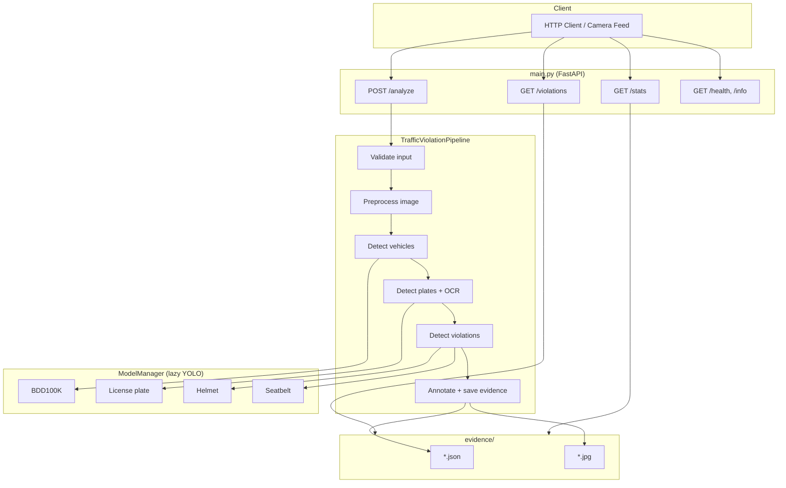

# Traffic Violation Detection System

A FastAPI-based computer vision backend for automated traffic enforcement. The system analyzes road-scene images to detect vehicles, read license plates via OCR, flag helmet and seatbelt violations, annotate evidence images, and persist timestamped records for later retrieval and reporting.

Built for the Flipkart hackathon workflow and deployable locally, via Docker, or on [Hugging Face Spaces](https://huggingface.co/spaces/Bikki26/traffic-management-system) (port **7860** in containerized deployments).

---

## Table of Contents

- [Overview](#overview)
- [Features](#features)
- [Architecture](#architecture)
- [Project Structure](#project-structure)
- [Processing Pipeline (Detailed Flow)](#processing-pipeline-detailed-flow)
- [Module Reference](#module-reference)
- [ML Models](#ml-models)
- [Configuration](#configuration)
- [API Reference](#api-reference)
- [Evidence Storage](#evidence-storage)
- [Getting Started](#getting-started)
- [Docker Deployment](#docker-deployment)
- [Hugging Face Sync](#hugging-face-sync)
- [Extending the System](#extending-the-system)
- [Performance & Limitations](#performance--limitations)
- [Troubleshooting](#troubleshooting)

---

## Overview

The application exposes a REST API. Clients upload a traffic camera or dashcam image along with optional GPS coordinates and a timestamp. The backend runs a multi-stage vision pipeline powered by YOLOv11 (Ultralytics) and RapidOCR, then returns structured JSON plus a base64-encoded annotated image. Every successful analysis is also written to disk under `evidence/` as paired JSON and JPEG files.

**Design principles:**

| Principle | How it is implemented |
|-----------|----------------------|
| Modular pipeline | Each detection step is a separate method on `TrafficViolationPipeline` |
| Lazy model loading | YOLO weights load on first use via `ModelManager` |
| Lenient error handling | Failed steps log and return partial results instead of crashing the whole run |
| Centralized config | Thresholds, paths, and colors live in `pipeline/config.py` |
| Timestamped evidence | Filenames derive from ISO timestamps to avoid collisions |

---

## Features

### Detection capabilities

| Capability | Model / tool | Output |
|------------|--------------|--------|
| Vehicle detection | `bdd100k_opensource.pt` (YOLOv11) | Bounding boxes + class labels (car, bike, truck, bus, etc.) |
| License plate localization | `License_plate_bb.pt` | Plate bounding boxes on the full frame |
| Plate text extraction | RapidOCR (ONNX) | Cleaned alphanumeric plate strings |
| Helmet violation | `helmet_detection.pt` | Riders flagged as `"Without Helmet"` |
| Seatbelt violation | `seatbelt_detection.pt` | Occupants flagged as `"person-noseatbelt"` |

### API capabilities

- **Analyze** — Run the full pipeline on a single image
- **Violations** — List all stored evidence records (newest first)
- **Stats** — Aggregate violation counts across all records
- **Health / Info** — Service status and endpoint discovery

### Image preprocessing

Before inference, frames pass through undistortion, CLAHE lighting enhancement, motion-blur reduction, and a dynamic ROI mask that hides the top 20% of the frame (sky/buildings). Optional dehazing is available but disabled by default in the main pipeline.

---

## Architecture



**Request lifecycle for `POST /analyze`:**

1. FastAPI reads uploaded image bytes and form fields (`timestamp`, `gps_lat`, `gps_lon`).
2. A singleton `TrafficViolationPipeline` instance orchestrates all vision steps.
3. Results are returned as JSON; annotated JPEG is included as base64.
4. Evidence JSON + annotated JPEG are persisted under `evidence/`.

---

## Project Structure

```
new_flipkart_traffic/
├── main.py                          # FastAPI app, routes, error handlers
├── Dockerfile                       # CUDA PyTorch base, exposes port 7860
├── README.md                        # Original project readme
├── Readme_2.md                      # This file
│
├── pipeline/                        # Core vision pipeline package
│   ├── __init__.py                  # Exports TrafficViolationPipeline, Config
│   ├── config.py                    # Paths, thresholds, preprocessing params
│   ├── models.py                    # ModelManager — lazy YOLO loaders
│   ├── preprocessing.py             # Image enhancement chain
│   ├── ocr_processor.py             # RapidOCR plate text extraction
│   ├── utils.py                     # I/O, validation, drawing, evidence I/O
│   └── pipeline.py                  # TrafficViolationPipeline orchestrator
│
├── evidence/                        # Created at runtime (gitignored)
│   ├── 2025-06-18T14-30-22.123Z.json
│   └── 2025-06-18T14-30-22.123Z.jpg
│
├── bdd100k_opensource.pt            # Primary vehicle detector (Git LFS)
├── UVH-26-MV-YOLOv11-S.pt          # Alternate detector for 3-wheelers (reserved)
├── License_plate_bb.pt              # License plate bounding-box model
├── helmet_detection.pt              # Helmet / no-helmet classifier
├── seatbelt_detection.pt            # Seatbelt compliance model
│
├── .github/workflows/
│   └── sync_to_hf.yml               # Auto-push to Hugging Face Space on main
│
└── .gitattributes                   # Git LFS tracking for .pt and image files
```

**Note:** Model weights (`.pt`) are stored with Git LFS. Clone with LFS enabled: `git lfs pull`.

---

## Processing Pipeline (Detailed Flow)

The master entry point is `TrafficViolationPipeline.run()` in `pipeline/pipeline.py`. It executes the following steps in order:

```
Image bytes (API upload)
        │
        ▼
┌───────────────────────┐
│ 0. Input validation   │  GPS bounds, ISO 8601 timestamp
└───────────┬───────────┘
            ▼
┌───────────────────────┐
│ 1. Decode image       │  image_bytes → OpenCV BGR numpy array
└───────────┬───────────┘
            ▼
┌───────────────────────┐
│ 2. Preprocess         │  undistort → CLAHE → sharpen → ROI mask
│    (preprocessing.py) │  (dehaze optional, off by default)
└───────────┬───────────┘
            ▼
┌───────────────────────┐
│ 3. Vehicle detection  │  BDD100K YOLO on original frame
│    detect_vehicles()  │  conf ≥ 0.45, imgsz 1088
└───────────┬───────────┘
            ▼
┌───────────────────────┐
│ 4. Plate detection    │  License plate YOLO on full frame
│    detect_license_    │  (global mode — not cropped per vehicle)
│    plates()           │
└───────────┬───────────┘
            ▼
┌───────────────────────┐
│ 5. OCR                │  Crop each plate → white border → RapidOCR
│    extract_plate_text │  Uppercase, alphanumeric cleanup
└───────────┬───────────┘
            ▼
┌───────────────────────┐
│ 6. Violation detection│  Helmet + seatbelt YOLO on full frame
│    detect_violations  │  Filter to violation classes only
└───────────┬───────────┘
            ▼
┌───────────────────────┐
│ 7. Annotate           │  Green = vehicles, yellow = plates, red = violations
│    annotate_image()   │
└───────────┬───────────┘
            ▼
┌───────────────────────┐
│ 8. Generate evidence  │  Save JSON + JPEG to evidence/
│    generate_evidence  │
└───────────┬───────────┘
            ▼
    API JSON response + base64 JPEG
```

### Important behavioral notes

**Global vs. per-vehicle detection**

License plates, helmet checks, and seatbelt checks currently run on the **entire original frame**, not on individual vehicle crops. Violation records use `"vehicle_class": "unknown"` because they are not linked to a specific vehicle bounding box. An older per-vehicle crop implementation remains commented out in `pipeline.py` for reference.

**UVH model fallback (disabled)**

Code exists to switch from BDD100K to the UVH model when 3-wheelers, mini-buses, or tempo travellers are detected. This logic is **commented out**; only BDD100K runs today. The UVH weights are still present for future activation.

**Preprocessing scope**

Vehicle detection uses the **original** image. The preprocessed frame is computed but not passed to the current detection steps (preprocessing runs in `run()` but detectors receive `original_img`).

---

## Module Reference

### `main.py` — FastAPI application

| Route | Method | Purpose |
|-------|--------|---------|
| `/` | GET | Basic service status |
| `/health` | GET | Health check with evidence folder status |
| `/analyze` | POST | Main analysis endpoint (multipart form) |
| `/violations` | GET | Load all evidence JSON files |
| `/stats` | GET | Aggregate counts from evidence |
| `/info` | GET | API metadata and endpoint list |

Creates one global `TrafficViolationPipeline()` at import time. Models load lazily on the first `/analyze` request.

### `pipeline/config.py` — Configuration

Single `Config` class holding:

- Absolute paths to all `.pt` model files
- `EVIDENCE_FOLDER` path
- Per-model confidence thresholds
- BDD100K vehicle class IDs
- Violation class name filters (`"Without Helmet"`, `"person-noseatbelt"`)
- Preprocessing parameters (CLAHE, blur kernel, ROI percentage)
- OCR settings (white border padding, text cleanup rules)
- Annotation colors (BGR)
- API host/port/workers

Call `Config.ensure_folders_exist()` at pipeline init to create `evidence/`.

### `pipeline/models.py` — ModelManager

Lazy-loads and caches five YOLO models:

| Method | Model file |
|--------|------------|
| `load_bdd100k()` | `bdd100k_opensource.pt` |
| `load_uvh()` | `UVH-26-MV-YOLOv11-S.pt` |
| `load_license_plate()` | `License_plate_bb.pt` |
| `load_helmet()` | `helmet_detection.pt` |
| `load_seatbelt()` | `seatbelt_detection.pt` |

Each model is instantiated once and reused for subsequent requests.

### `pipeline/preprocessing.py`

| Function | Description |
|----------|-------------|
| `undistort_frame()` | Removes barrel distortion using estimated camera matrix |
| `enhance_lighting()` | CLAHE on L channel in LAB color space |
| `reduce_motion_blur()` | Unsharp masking via Gaussian difference |
| `dehaze_frame()` | Dark-channel prior dehazing (optional) |
| `apply_dynamic_roi()` | Masks top 20% of frame to focus on road |
| `preprocess_frame()` | Runs the full chain; returns `(processed, original_shape)` |

### `pipeline/ocr_processor.py` — OCRProcessor

- Initializes `RapidOCR()` once per pipeline instance
- For each plate box: crops region, adds 12px white border, runs recognition-only OCR
- Cleans text: uppercase, alphanumeric + hyphens only
- Skips empty or failed crops without failing the whole batch

### `pipeline/utils.py`

| Category | Functions |
|----------|-----------|
| Image I/O | `image_bytes_to_numpy`, `numpy_to_jpeg_bytes`, `numpy_to_base64` |
| Geometry | `denormalize_bboxes` (scale from model input size to original) |
| Drawing | `draw_bounding_boxes` with type-based colors |
| Validation | `validate_gps_timestamp`, `detect_3wheeler` |
| Evidence | `get_evidence_filename`, `save_json_evidence`, `save_annotated_image`, `load_all_evidence` |

### `pipeline/pipeline.py` — TrafficViolationPipeline

The orchestrator class with nine logical steps (validation + eight processing stages). Public method:

```python
result = pipeline.run(image_bytes, timestamp, gps)
# result keys: success, evidence, annotated_image_bytes, annotated_image_base64, error
```

---

## ML Models

All inference uses [Ultralytics YOLO](https://docs.ultralytics.com/) via `model.predict()`.

| File | Role | Default confidence |
|------|------|-------------------|
| `bdd100k_opensource.pt` | Multi-class road actor detection | 0.45 |
| `UVH-26-MV-YOLOv11-S.pt` | Specialized vehicles (3-wheelers, etc.) — reserved | 0.45 |
| `License_plate_bb.pt` | License plate bounding boxes | 0.40 |
| `helmet_detection.pt` | Helmet compliance | 0.40 |
| `seatbelt_detection.pt` | Seatbelt compliance | 0.40 |

### BDD100K vehicle classes

```python
{
    "car": 0,
    "bike": 1,
    "truck": 2,
    "pedestrian": 3,
    "rider": 4,
    "bus": 5,
    "train": 6,
}
```

### Violation class filters

Only these raw model classes are treated as violations:

| Model | Raw class | Stored violation type |
|-------|-----------|----------------------|
| Helmet | `Without Helmet` | `no_helmet` |
| Seatbelt | `person-noseatbelt` | `no_seatbelt` |

---

## Configuration

Edit `pipeline/config.py` to tune behavior without changing pipeline logic.

**Common adjustments:**

```python
# Lower threshold → more detections (may increase false positives)
CONFIDENCE_THRESHOLDS = {
    "bdd100k": 0.45,
    "license_plate": 0.4,
    "helmet": 0.4,
    "seatbelt": 0.4,
}

# OCR readability
OCR_PARAMS = {
    "white_border_px": 12,
}

# API binding (local dev uses port 8000; Docker/HF uses 7860 via uvicorn CMD)
API_HOST = "0.0.0.0"
API_PORT = 8000
API_WORKERS = 1
```

---

## API Reference

Base URL (local): `http://localhost:8000`  
Base URL (Docker / Hugging Face): `http://localhost:7860`

Interactive docs: `{base_url}/docs` (Swagger UI)

### POST `/analyze`

Analyze an image for traffic violations.

**Form fields:**

| Field | Required | Default | Description |
|-------|----------|---------|-------------|
| `file` | Yes | — | Image file (JPEG, PNG, etc.) |
| `timestamp` | No | Current UTC ISO time | e.g. `2025-06-18T14:30:22.123Z` |
| `gps_lat` | No | `0.0` | Latitude (−90 to 90) |
| `gps_lon` | No | `0.0` | Longitude (−180 to 180) |

**Example:**

```bash
curl -X POST "http://localhost:8000/analyze" \
  -F "file=@road_scene.jpg" \
  -F "timestamp=2025-06-18T14:30:22.123Z" \
  -F "gps_lat=28.6139" \
  -F "gps_lon=77.2090"
```

**Success response (200):**

```json
{
  "success": true,
  "timestamp": "2025-06-18T14:30:22.123Z",
  "gps": {"latitude": 28.6139, "longitude": 77.2090},
  "violations_count": 1,
  "plates_count": 1,
  "evidence": {
    "timestamp": "2025-06-18T14:30:22.123Z",
    "gps": [28.6139, 77.2090],
    "plates": [
      {"text": "DL1AB1234", "confidence": 0.92, "box": [100, 50, 200, 90]}
    ],
    "violations": [
      {"type": "no_helmet", "vehicle_class": "unknown", "confidence": 0.87, "box": [300, 100, 380, 200]}
    ],
    "annotated_image_path": "evidence/2025-06-18T14-30-22.123Z.jpg"
  },
  "annotated_image_base64": "..."
}
```

### GET `/violations`

Returns all evidence records from `evidence/*.json`, sorted newest first.

```bash
curl "http://localhost:8000/violations"
```

### GET `/stats`

Aggregates totals across all evidence files.

```bash
curl "http://localhost:8000/stats"
```

**Response fields:** `total_records`, `total_violations`, `total_plates`, `average_violations_per_record`, `violation_counts`, `vehicle_class_counts`.

### GET `/health` and GET `/info`

Health returns service status and whether the evidence folder exists. Info lists all endpoints and model filenames.

---

## Evidence Storage

Each successful analysis creates two files in `evidence/`:

| File | Content |
|------|---------|
| `{timestamp}.json` | Structured detection results |
| `{timestamp}.jpg` | Annotated image with color-coded boxes |

Timestamps in filenames replace `:` with `-` for filesystem compatibility  
(e.g. `2025-06-18T14:30:22.123Z` → `2025-06-18T14-30-22.123Z`).

**Evidence JSON schema:**

```json
{
  "timestamp": "ISO-8601 string",
  "gps": [latitude, longitude],
  "plates": [
    {"text": "string", "confidence": 0.0, "box": [x1, y1, x2, y2]}
  ],
  "violations": [
    {"type": "no_helmet | no_seatbelt", "vehicle_class": "string", "confidence": 0.0, "box": [x1, y1, x2, y2]}
  ],
  "annotated_image_path": "evidence/....jpg"
}
```

The `evidence/` directory is gitignored; records persist on the host filesystem or container volume.

---

## Getting Started

### Prerequisites

- Python 3.8+
- Git with [Git LFS](https://git-lfs.com/) (for model weights)
- CUDA GPU optional (CPU inference works, slower)
- 8 GB+ RAM recommended

### 1. Clone and fetch models

```bash
git clone <repository-url>
cd new_flipkart_traffic
git lfs pull
```

### 2. Create virtual environment

```bash
python -m venv traffic_venv

# Windows
traffic_venv\Scripts\activate

# Linux / macOS
source traffic_venv/bin/activate
```

### 3. Install dependencies

Core packages inferred from the codebase:

```bash
pip install --upgrade pip
pip install fastapi uvicorn python-multipart
pip install ultralytics opencv-python numpy
pip install rapidocr-onnxruntime
```

If a `requirements.txt` is present in your checkout, prefer:

```bash
pip install -r requirements.txt
```

### 4. Run locally

```bash
# Development (auto-reload)
uvicorn main:app --reload --host 0.0.0.0 --port 8000

# Or via main.py (uses Config.API_PORT = 8000)
python main.py
```

Open `http://localhost:8000/docs` for interactive API testing.

First `/analyze` request triggers model loading and may take noticeably longer.

---

## Docker Deployment

The included `Dockerfile` uses `pytorch/pytorch:2.1.2-cuda12.1-cudnn8-runtime` for GPU support.

```bash
docker build -t traffic-violation-api .
docker run --gpus all -p 7860:7860 -v $(pwd)/evidence:/app/evidence traffic-violation-api
```

The container listens on **port 7860** (configured for Hugging Face Spaces). Map accordingly when running locally.

Ensure `requirements.txt` exists before building; the Dockerfile installs from it.

---

## Hugging Face Sync

The workflow in `.github/workflows/sync_to_hf.yml` force-pushes the `main` branch to the Hugging Face Space `Bikki26/traffic-management-system` on every push to `main`.

Requirements:

- GitHub secret `HF_TOKEN` with write access to the Space
- Git LFS enabled in the workflow checkout

The README frontmatter (`sdk: docker`, `app_port: 7860`) configures the Space runtime.

---

## Extending the System

### Add a new violation type

1. **Config** — Add model path and violation class filter in `pipeline/config.py`
2. **ModelManager** — Add a lazy loader in `pipeline/models.py`
3. **Pipeline** — Add detection logic in `detect_violations()` or a new method
4. **Annotation** — Optionally extend `annotate_image()` with a new color in `ANNOTATION_COLORS`

### Re-enable per-vehicle detection

Uncomment the crop-based logic in `detect_license_plates()` and `detect_violations()` inside `pipeline/pipeline.py`. Link violations to vehicles via `vehicle_idx` and set `vehicle_class` from the parent detection.

### Re-enable UVH model switching

Uncomment the UVH fallback block in `detect_vehicles()` that checks for 3-wheelers (`detect_3wheeler`) and `Config.UVH_TRIGGER_VEHICLES`.

### Custom preprocessing

Add functions in `preprocessing.py` and insert them into the `preprocess_frame()` chain. Pass the preprocessed image to detectors if models benefit from enhanced input.

---

## Performance & Limitations

### Approximate inference times (single image)

| Step | GPU | CPU |
|------|-----|-----|
| Vehicle detection | 150–200 ms | 500–800 ms |
| Plate detection | 50–100 ms | 200–300 ms |
| OCR (per plate) | ~100 ms | ~100 ms |
| Helmet + seatbelt | 100–200 ms | 400–600 ms |

Times vary with image resolution, hardware, and number of detections.

### Known limitations

1. **Global detection mode** — Plates and violations are not tied to specific vehicle boxes
2. **UVH model inactive** — 3-wheeler-specific detection path is commented out
3. **Preprocessing unused by detectors** — Enhanced frame is computed but detectors use the original image
4. **OCR accuracy** — Best with clear, frontal, well-lit plates; RapidOCR may misread damaged or angled plates
5. **Evidence is local filesystem** — No database; `/violations` reads JSON files from disk
6. **Single worker default** — `API_WORKERS = 1`; multiple workers duplicate model memory
7. **No facial recognition endpoint** — Listed in `/info` metadata only; not implemented in current code

### Optimization tips

- Use a CUDA-capable GPU and PyTorch with CUDA support
- Keep `API_WORKERS = 1` unless you have enough RAM/VRAM per worker
- Tune confidence thresholds in `config.py` for your camera setup
- Consider quantized or smaller YOLO variants for edge deployment

---

## Troubleshooting

| Problem | Likely cause | Fix |
|---------|--------------|-----|
| Model not found | Missing LFS pull or wrong path | Run `git lfs pull`; verify paths in `config.py` |
| Empty detections | Threshold too high or poor image quality | Lower `CONFIDENCE_THRESHOLDS`; check lighting and angle |
| OCR returns empty text | Small or blurry plate crop | Increase `white_border_px`; improve source resolution |
| Out of memory | All models loaded on small GPU | Use CPU, reduce image size, keep one worker |
| Evidence not listed | Folder empty or wrong path | Confirm `evidence/` exists; check write permissions |
| Docker build fails on pip | Missing `requirements.txt` | Create requirements file with listed dependencies |
| Port conflict | HF uses 7860, local dev uses 8000 | Match port to your run command |

---

## Dependencies

| Package | Purpose |
|---------|---------|
| `fastapi` | Web framework |
| `uvicorn` | ASGI server |
| `python-multipart` | File upload support |
| `ultralytics` | YOLOv11 inference |
| `opencv-python` | Image I/O and preprocessing |
| `numpy` | Array operations |
| `rapidocr-onnxruntime` | License plate OCR |
| `torch` | Deep learning backend (via Ultralytics / Docker base image) |

---

## License

Pre-trained model weights may carry separate licenses. Verify compliance with each model's terms before production deployment.

---

**Last updated:** June 2025  
**Version:** 1.0.0
